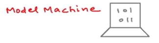
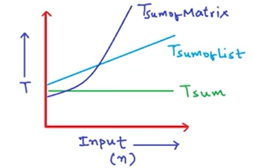

How to Analyse Time Complexity
==============================

Running time of a program depends upon
 1. single vs multiprocessor
 2. Read/Write speed to memory
 3. 32 bit vs 64 bit
 4. Input rate of growth of time

In time complexity analysis we only care about the Input rate.

Lets assume a hypothetical machine:



- single processor
- 32 bit
- sequential execution
- 1 unit time for arithmatic and logical operations
- 1 unit for assignment and return


We are more interested in calculating a function which represents the rate of growth of time wrt input. The analysis will be the same

Lets say we want to write a function which computes the sum of two numbers:
```
def sum(a, b):
    """
    Computes the summation of two numbers

    Args: 
        a (int, float): a number of choice 
        b (int, float): b number of choice

    Returns:
        a number which represents the summation of two numbers
    """
    return a+b 
```

above function takes $T_{sum} = 2$ on our hypothetical machine
- 1 unit for the addition operation
- 1 unit for the return operation

We can say that this is a constant time function as it will always be 2

Lets check another function:
```
def sum_of_lists(A, n):
    """
    computes the summation of all the elements inside the list passed

    Args:
        A (list(int), list(float)): A list of integers or floats

        n (int): length of a list

    Returns:
        Summation of elements inside the list
    """
    # 1
    total = 0
    # 2
    for i in range(0, n-1):
    # 3
        total = total + A[i]
    # 4
    return total
```
the breakdown of the function operations is as follows:

| step | cost | no of times | Reason                                       |
| :--- | :--- | :---------- | :------------------------------------------- |
| 1    | 1    | 1           | one assignment operation                     |
| 2    | 2    | n+1         | one assignment and one comparision operation |
| 3    | 2    | n           | one assignment and one summation operation   |
| 4    | 1    | 1           | one return operation                         |

so the total time complexity can be represented as:

$T_{sum of list} = 1 + 2(n+1) + 2n + 1$

=> $T_{sumoflist} = 4(n) + 4$

$T_{sumoflist}(n) = c(n) + c'$

where $c = c2+c3$ and $c' = c1 + c2 + c4$

this is a linear function as its proportional to $n$

Comparision of Time complexities

$T_{sum} = k$

$T_{sumofList} = a(n) + b$

$T_{sumofMatrix} = a(n)^2 + b(n) +c$



here we can see:
- $T_{sum}$ is constant and is parallel to Input axis with constant rate of time. $O(1)$
- $T_{sumofList}$ is linear wrt to time. the equation has a degree 2 .to simplify we will only consider the higher order term so the complexity is $O(n)$
- $T_{sumofMatrix}$ is quadratic wrt to time. the equation has a degree 2. to simplify we will only consider the higher order term so the complexity is $O(n^2)$

Here $O(1)$, $O(n)$, $O(n^2)$ are called Asymptotic notations. There is similarly $\theta$, $\Omega$ other than Big-oh